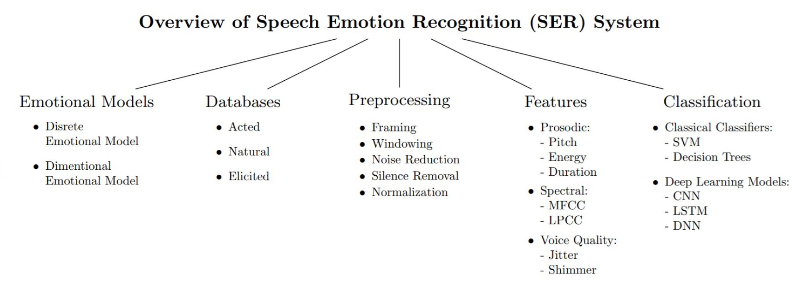
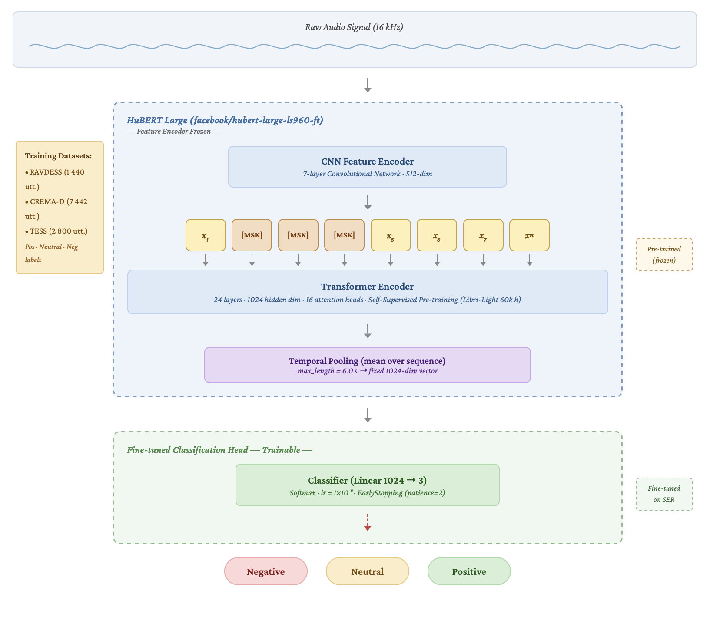
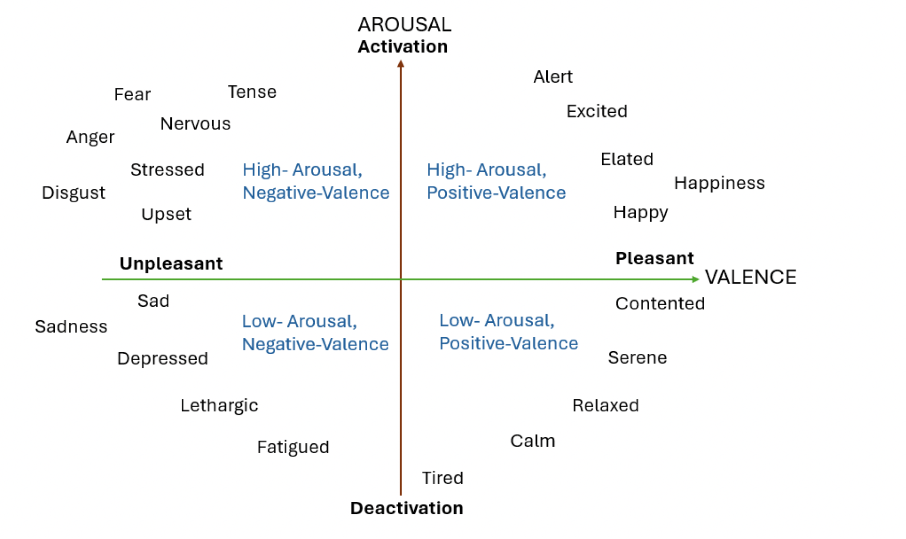
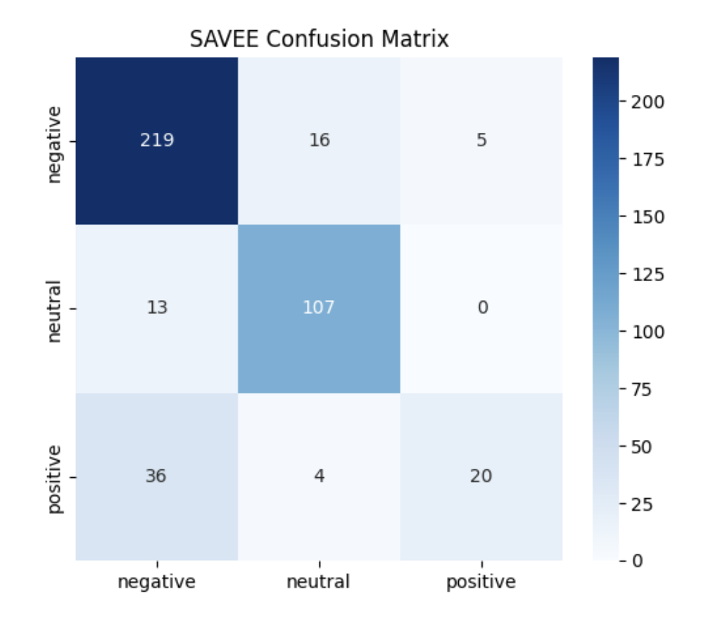

# High-Performance Speech Emotion Recognition using HuBERT-Large

This repository provides an open-source implementation of a highly accurate Speech Emotion Recognition (SER) system based on the **HuBERT-Large** architecture. It is designed to classify audio sequences into three fundamental emotion categories: **Positive, Neutral, and Negative**.

The core strength of this project lies in its **"Mixed-Corpus"** training strategy, enabling the model to generalize effectively across various acoustic environments, speaker demographics, and accents—a capability notably absent in many traditional, single-corpus SER models.

### Motivation: Why Mixed-Corpus?
As shown in recent reviews of SER databases, the field leans heavily on a small group of acted, English-language datasets. This often leads to models that perform well in the lab but struggle in real-world, naturalistic conditions. Our "Mixed-Corpus" approach directly addresses this lack of diversity by combining multiple datasets, resulting in a significantly more robust and generalized system.


## 🌟 Key Features

* **Advanced Architecture:** Fine-tuned `facebook/hubert-large-ls960-ft` (Transformer-based self-supervised architecture).
* **High Generalization (Zero-Shot):** Achieves **82.38% Accuracy** on unseen, out-of-distribution data (SAVEE dataset).
* **Streamlined Inference:** A lightweight script (`ser_inference.py`) to process `.wav` files via chunk-based temporal analysis.
* **Granular Emotion Mapping:** Converts raw probabilities into meaningful metrics, including a composite **Positivity Score**.

---

## 🏗 General SER Pipeline

Before delving into the specific HuBERT architecture, it is helpful to understand the standard pipeline for a Speech Emotion Recognition system, which includes dataset preparation, preprocessing, feature extraction, and finally, classification.



## 🧠 Methodology & Model Architecture



This model deviates from traditional CNN or LSTM-based approaches by leveraging **HuBERT (Hidden-Unit BERT)**. Unlike older methods, HuBERT uses masked prediction to learn rich, self-supervised acoustic representations.

### Model Pipeline:
1. **Feature Extraction:** A frozen 7-layer Convolutional Neural Network (CNN) processes the raw waveform (16kHz), capturing low-level acoustic features and downsampling the input into 25ms frames.
2. **Contextual Transformer (Encoder):** 24 Transformer blocks with 1024-dimensional hidden states and 16 attention heads analyze the long-term contextual dependencies within the audio sequence.
3. **Classification Head:** The temporal features are mean-pooled and passed through a fully connected layer (Dense) mapping the 1024-dimensional vector into the 3 target classes: Negative, Neutral, Positive.

To prevent catastrophic forgetting during the fine-tuning phase, the underlying CNN feature extractor was completely frozen (Transfer Learning), ensuring the model retained its general linguistic capabilities.

---

## 📊 Datasets & Preprocessing

To ensure robust performance in diverse scenarios, a carefully curated selection of acted studio datasets was merged to form the training pool. 

### Label Mapping Protocol
Original emotions were mapped onto a 3-dimensional polarity scale based on valence and arousal:
* **Positive:** Happy, Pleasant Surprise.
* **Neutral:** Neutral, Calm.
* **Negative:** Angry, Sad, Fear, Disgust.

*(Note: The ambiguous "Surprise" emotion was excluded due to its high contextual variability).*

The theoretical foundation for this mapping relies on dimensional emotion models, such as the Circumplex model, which maps discrete emotions onto continuous Valence (Pleasant/Unpleasant) and Arousal (Activation/Deactivation) axes:



### 1. In-Distribution (Training)
* **RAVDESS:** High-quality North American recordings from 24 professional actors.
* **TESS:** Explicit emotion expressions by younger and older female speakers.
* **CREMA-D:** A highly diverse dataset featuring 91 actors of varying ethnic backgrounds.

### 2. Out-of-Distribution / Zero-Shot (Testing)
* **SAVEE:** British male speakers. **This dataset was intentionally excluded from training** to rigorously benchmark the model's zero-shot generalization capabilities.

---

## 📈 Experimental Results & Benchmarks

The proposed "Mixed-Corpus" HuBERT model was benchmarked against an industry-standard baseline: `ehcalabres/wav2vec2-lg-xlsr-en-speech-emotion-recognition` (which is typically trained solely on RAVDESS). 

The results demonstrate a massive leap in robustness, particularly on the unseen SAVEE dataset.

| Dataset (Split) | Metric | Proposed Model (HuBERT-Large) | Baseline (Wav2Vec2-XLSR) |
| :--- | :--- | :---: | :---: |
| **RAVDESS** | Accuracy | 91.91% | **95.74%** |
| | Weighted F1 | 0.92 | **0.96** |
| **TESS** | Accuracy | **99.82%** | 63.61% |
| | Weighted F1 | **1.00** | 0.60 |
| **CREMA-D** | Accuracy | **86.13%** | 57.98% |
| | Weighted F1 | **0.85** | 0.62 |
| **SAVEE** (Zero-Shot)| Accuracy | **82.38%** | 55.33% |
| | Weighted F1 | **0.81** | 0.54 |

**Discussion:** While the baseline slightly outperforms on RAVDESS (due to severe overfitting to that specific dataset), our proposed HuBERT model absolutely dominates across all other datasets. The 82.38% zero-shot accuracy on SAVEE proves the model's ability to learn universal acoustic emotional cues rather than simply memorizing speaker identities.

### Zero-Shot Generalization (SAVEE) Confusion Matrix
The following confusion matrix illustrates the model's performance on the unseen SAVEE dataset:



---

## 🚀 Installation & Usage

### 1. Clone the Repository
```bash
git clone https://github.com/taha-yilmaz/Generalized-SER-HuBERT.git
cd Generalized-SER-HuBERT
```

### 2. Install Dependencies
```bash
pip install -r requirements.txt
```

### 3. Download Model Weights
Because the model weights are large, they are hosted securely on Google Drive. 
You must download the folder and place it in the `models/` directory.

* **Google Drive Link:** [Download HuBERT_SER Weights](https://drive.google.com/file/d/1XxCUk2Xw0f1euR_3CeqP4ixrFLoE9BkI/view)

Once downloaded, extract the contents to `./models/HuBERT_SER/`. 
Your directory structure should look like this:
```
Generalized-SER-HuBERT/
├── models/
│   └── HuBERT_SER/
│       ├── config.json
│       ├── preprocessor_config.json
│       └── model.safetensors
├── ser_inference.py
├── requirements.txt
└── README.md
```

### 4. Run Inference
You can analyze any 16kHz `.wav` file using the inference script:

```bash
python ser_inference.py --audio path/to/your_audio.wav --model_dir ./models/HuBERT_SER
```

**Output Example:**
```text
🎵 Analyzing audio file: sample.wav
📦 Loading HuBERT SER model from './models/HuBERT_SER' onto mps...
✅ Model loaded successfully!

=== Analysis Results ===
File: sample.wav (12.4s)
Dominant Emotion: NEGATIVE
Positivity Score: 0.35 / 1.00

Emotion Distribution:
  - Positive: 15.0%
  - Neutral: 20.0%
  - Negative: 65.0%

Segments:
  [00.00s - 05.00s] Negative (Conf: 0.89)
  [05.00s - 10.00s] Neutral (Conf: 0.65)
  [10.00s - 12.40s] Negative (Conf: 0.92)
```

---

## 📜 Citation & License

This implementation was developed as part of an advanced AI HR pipeline integration. If you utilize this model or architecture, please consider referencing this repository.

*This project is licensed under the MIT License.*
